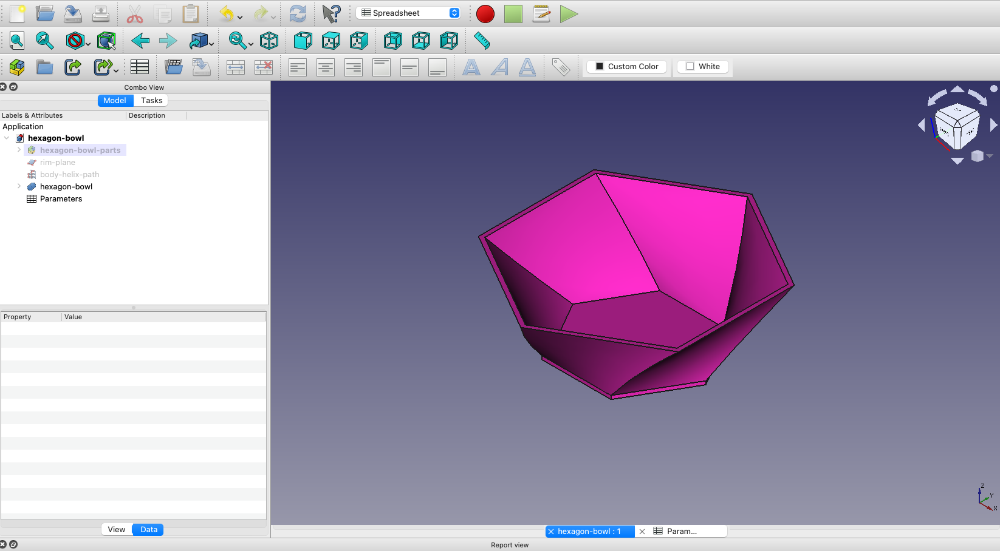
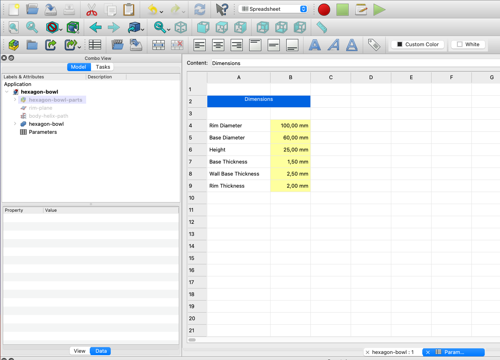
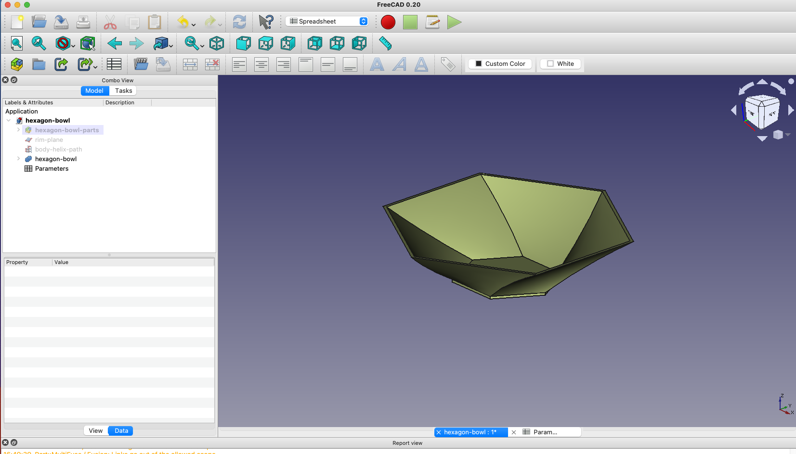
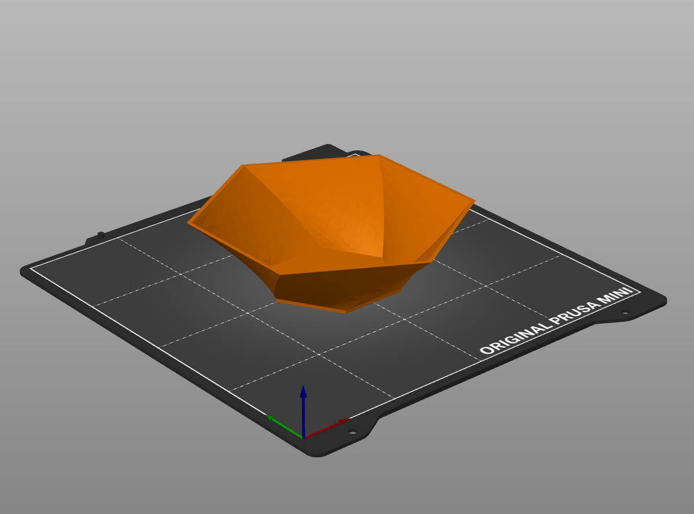
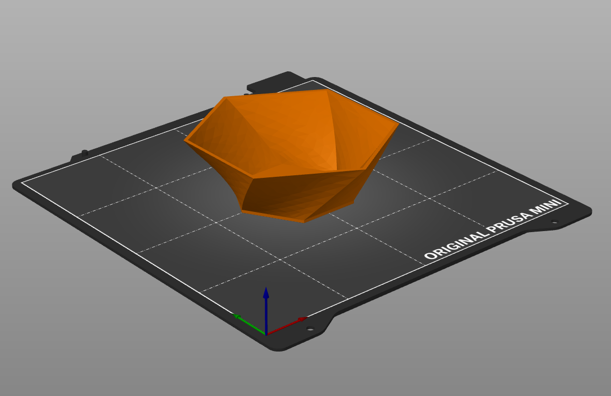
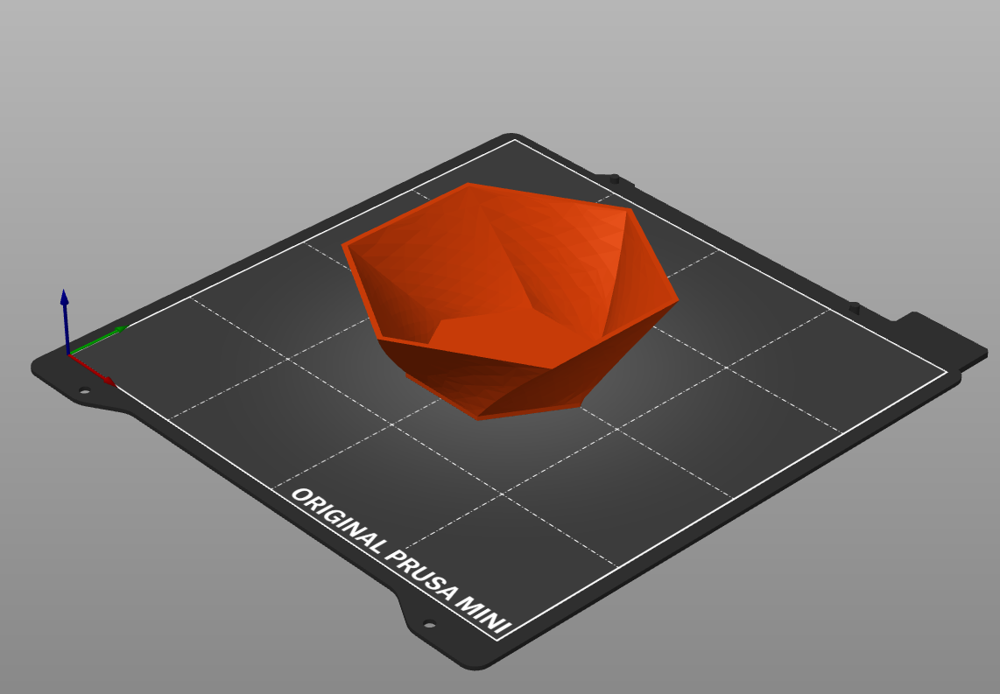
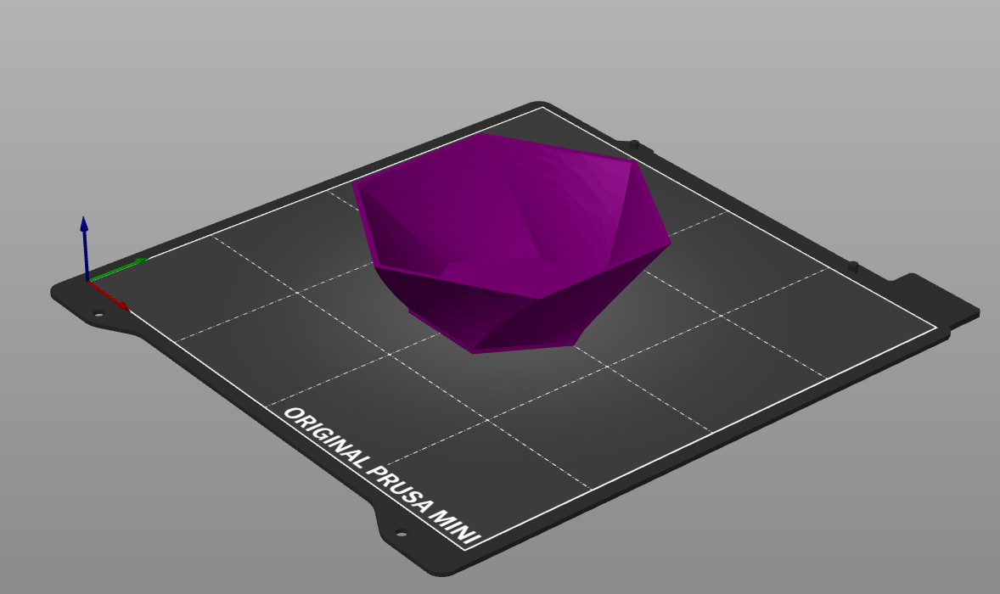

# 3d-printing-hexagon-bowl

Parametric Hexagon built using [FreeCAD](https://www.freecadweb.org/)

## Requirements

* [FreeCAD](https://www.freecadweb.org/) >= 1.20

## References

* https://www.freecadweb.org/

## Images

## License

This module is released under the GNU General Public License Version 3:

* [http://www.gnu.org/licenses/gpl-3.0-standalone.html](http://www.gnu.org/licenses/gpl-3.0-standalone.html)

## Author Information

* [Christian González Di Antonio](https://github.com/christiangda)